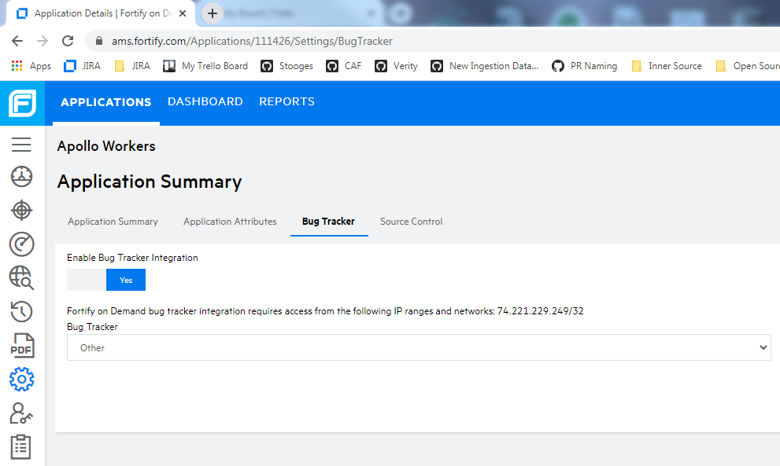

# Fortify Issue Manager

This is a utility to find issues created by Fortify on Demand scans and create corresponding bugs in a bug tracker like Octane. Once the bugs are created they are linked back to the Fortify on Demand issue. Users can then click the `View Bug` button in Fortify on Demand to navigate to the corresponding bug.

### Fortify on Demand Configuration
You will need to configure the Fortify on Demand application to `Enable Bug Tracker Integration` and set `Bug Tracker` to `Other`. This can be done from the Fortify on Demand Applications view > Settings > Bug Tracker tab.



### fortify-java-issue-manager

It can be used from another Java project by including the following dependency:

```xml
<dependency>
    <groupId>com.microfocus.security.automation.fortify</groupId>
    <artifactId>fortify-issue-manager</artifactId>
</dependency>
```

It makes the following `static` method available in the `FortifyIssueManager` class:

```java
public static boolean manageIssues(final boolean dryRun, final String scriptFile)
```

### fortify-java-issue-manager-cli

This modules provides a simple command-line interface which wraps the `manageIssues()` function.

    Usage: fortify-issue-manager [-d] -s=<scriptFile>
      -d, --dryRun
             If true, the tool lists the bug details but does not create them. Defaults to false.
      -s, --scriptFile=<scriptFile>
             Specifies the script file with the `getPayload` function to create the bug details

A javascript file that includes a `getPayload` function must be specified.

The `getPayload` function will be passed the following arguments:
- applicationId - The Fortify application ID
- applicationName - The Fortify application Name
- severity - The severity of the Fortify issue
- category - The category of the Fortify issue
- description - The description of the Fortify vulnerabilities in the category

The script should return the payload for creating a bug in a bug tracking application.  

Here is a sample script file [getPayload.js](./fortify-issue-manager/src/test/resources/getPayload.js).

### Configuration
The following environment variables must be set:
- `FORTIFY_GRANT_TYPE`  
    This property configures the Fortify on Demand authentication grant type.  
    It must be set to `client_credentials` or `password`.

    If grant type is `client_credentials` then the following environment variables must be set:
     - `FORTIFY_CLIENT_ID`
     - `FORTIFY_CLIENT_SECRET`

    If grant type is `password` then the following environment variables must be set:
     - `FORTIFY_USERNAME`
     - `FORTIFY_PASSWORD`

- `FORTIFY_SCOPE`  
    This property configures the Fortify on Demand scope. Example: api-tenant

- `FORTIFY_API_URL`  
    This property configures the Fortify on Demand api url

- `FORTIFY_ISSUE_URL`  
    This property configures the Fortify on Demand issue url

- `FORTIFY_APPLICATION_IDS`  
    This property is a comma separated list of Fortify on Demand application ids

- `FORTIFY_RELEASE_FILTERS`  
    This property is a delimited list of field filters for Fortify on Demand releases.  
    If no release filters are specified, the following filter is applied:  
    `sdlcStatusType:Production`

- `FORTIFY_ISSUE_FILTERS`  
    This property is a delimited list of field filters for Fortify on Demand issues.  
    If no issue filters are specified, the following filters are applied:  
    `severityString:Critical|High+auditorStatus:Remediation Required`

- `TRACKER`
    This property defines the issue tracker to use.
    Supported trackers: JIRA, OCTANE

- `TRACKER_USERNAME`  
    This property configures the issue tracker username

- `TRACKER_PASSWORD`  
    This property configures the issue tracker password

- `TRACKER_API_URL`  
    This property configures the issue tracker url

#### Octane required configuration
- `TRACKER_WORKSPACE_ID`  
  This property configures the octane workspace id.

- `TRACKER_SHARED_SPACE_ID`  
  This property configures the octane shared space id.

Set the `FORTIFY_ISSUE_MANAGER_LOG_LEVEL` environment variable to configure the log level. Default is `INFO`.

#### Note
Fortify on Demand field filters are specified as follows:  
Field name and value should be separated by a colon (:). Multiple fields should be separated by a plus (+). Multiple fields are treated as an AND condition.  
Example, `fieldname1:value+fieldname2:value`  
Multiple values for a field should be separated by a pipe (|).  
Multiple values for a field are treated as an OR condition.  
Example, `fieldname1:value1|value2`

### fortify-issue-manager-cli-image
This module builds a Docker image for the command-line interface, potentially allowing for simpler usage in some environments.

Here is an example command:

```
docker container run --rm \
    -e FORTIFY_GRANT_TYPE=password \
    -e FORTIFY_USERNAME=<Fortify on Demand username> \
    -e FORTIFY_PASSWORD=<Fortify on Demand password> \
    -e FORTIFY_TENANT=<Fortify on Demand tenant> \
    -e FORTIFY_SCOPE=<Fortify on Demand scope> \
    -e FORTIFY_API_URL=<Fortify on Demand API URL> \
    -e FORTIFY_ISSUE_URL=<Fortify on Demand issue URL> \
    -e FORTIFY_APPLICATION_IDS=<Comma separated list of application ids> \
    -e FORTIFY_RELEASE_FILTERS=<Delimited list of release field filters> \
    -e FORTIFY_ISSUE_FILTERS=<Delimited list of issue field filters> \
    -e TRACKER=<JIRA|OCTANE> \
    -e TRACKER_USERNAME=<username> \
    -e TRACKER_PASSWORD=<password> \
    -e TRACKER_API_URL=<URL> \
    -e HTTP_PROXY \
    -v $(pwd):/wd \
    microfocus/fortify-issue-manager \
    -s=/wd/getPayload.js
```
